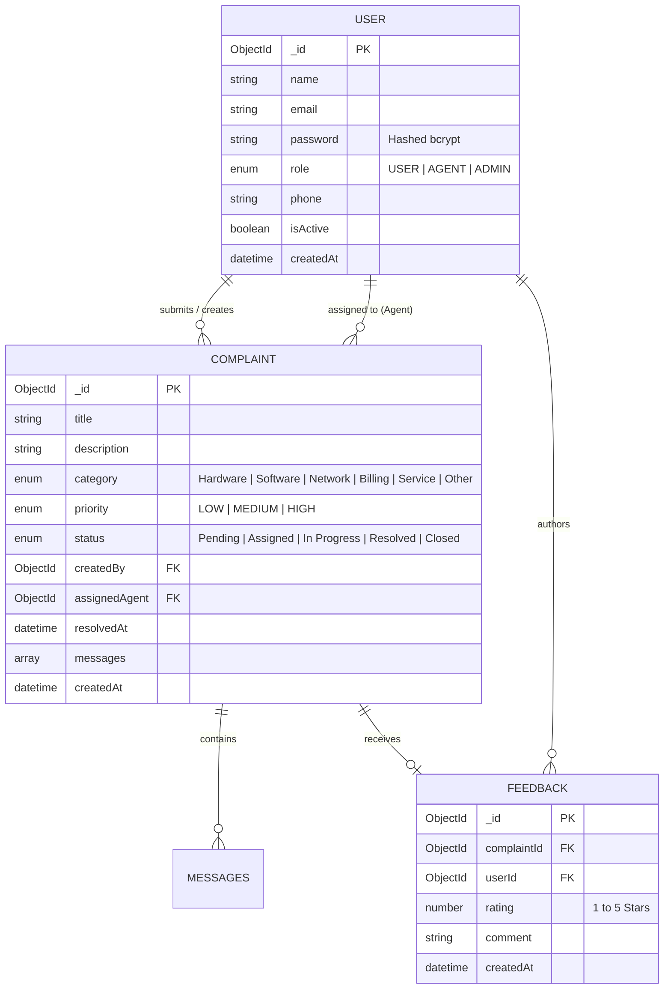
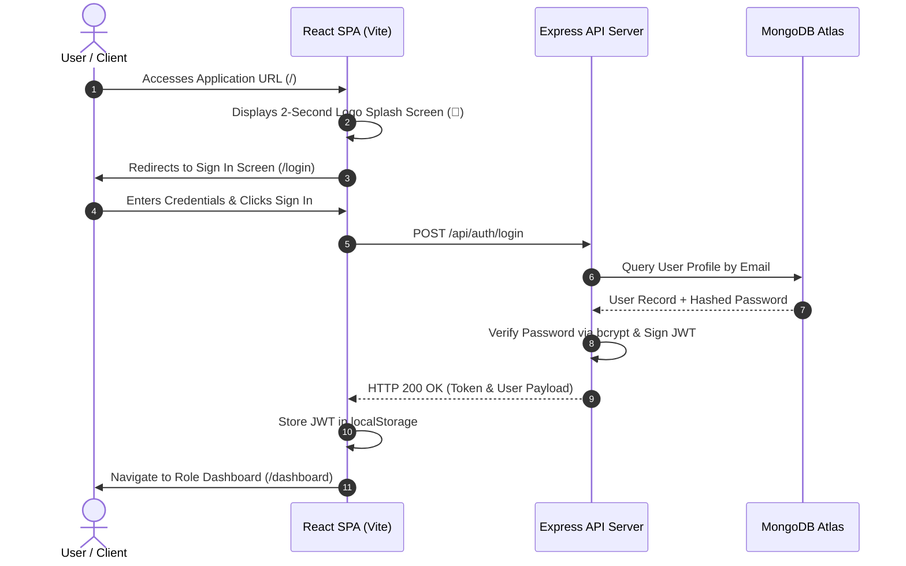

# 📄 FORMAL TECHNICAL PROJECT REPORT
## **PROJECT TITLE: ComplaintHub - Enterprise Online Complaint Registration & Management System**

---

### **DOCUMENT CONTROL**
- **Project Name**: ComplaintHub (Online Complaint Register)
- **Version**: 1.0.0
- **Deployment Platform**: Vercel Cloud Serverless
- **Database Backend**: MongoDB Atlas Cluster
- **Live Production URL**: [https://online-complaint-register-six.vercel.app](https://online-complaint-register-six.vercel.app)
- **Source Code Repository**: [https://github.com/sooryaprakashrnp-wq/online-complaint-register](https://github.com/sooryaprakashrnp-wq/online-complaint-register)

---

## 📌 TABLE OF CONTENTS
1. [Executive Summary](#1-executive-summary)
2. [Project Objectives & Scope](#2-project-objectives--scope)
3. [System Architecture & Design](#3-system-architecture--design)
   - 3.1 [High-Level Architecture](#31-high-level-architecture)
   - 3.2 [Entity-Relationship (ER) Diagram](#32-entity-relationship-er-diagram)
   - 3.3 [Model-View-Controller (MVC) Pattern](#33-model-view-controller-mvc-pattern)
4. [Roles & Responsibility Matrix](#4-roles--responsibility-matrix)
5. [User Flow & Operational Sequences](#5-user-flow--operational-sequences)
6. [Folder Structure & Codebase Layout](#6-folder-structure--codebase-layout)
7. [Backend Server & Security Implementation](#7-backend-server--security-implementation)
8. [Database Schema & Data Model](#8-database-schema--data-model)
9. [Frontend Design System & UX Features](#9-frontend-design-system--ux-features)
10. [Future System Enhancements & Extension Roadmap](#10-future-system-enhancements--extension-roadmap)
11. [Verification & Demonstration Links](#11-verification--demonstration-links)

---

## 1. EXECUTIVE SUMMARY

**ComplaintHub** is a web-based enterprise complaint management platform designed to streamline issue reporting, agent ticket assignment, real-time status tracking, and customer feedback collection.

Built using modern web technologies—**React 19 (Vite)** on the frontend, **Node.js with Express** on the backend, and **MongoDB Atlas** for cloud data persistence—the entire application is deployed as a single unified serverless project on **Vercel**.

Key achievements:
- Zero-latency page transitions with React Single Page Application (SPA) architecture.
- Full Role-Based Access Control (RBAC) supporting **Users**, **Support Agents**, and **System Administrators**.
- Integrated **2-second Animated Logo Splash Screen** upon initial user arrival.
- End-to-end ticket lifecycle management with interactive messaging and star-rating feedback loops.

---

## 2. PROJECT OBJECTIVES & SCOPE

### **Objectives**
1. **Automation**: Replace manual complaint logging with automated digital ticket creation.
2. **Transparency**: Provide users with transparent, real-time status updates (`Pending` ➔ `Assigned` ➔ `In Progress` ➔ `Resolved` ➔ `Closed`).
3. **Efficiency**: Enable support agents to quickly pick up, communicate on, and resolve tickets.
4. **Analytics**: Deliver administrative dashboards to evaluate support efficiency, priority distribution, and category trends.

### **Scope**
- Responsive web client accessible on mobile, tablet, and desktop viewports.
- Secure authentication utilizing JWT (JSON Web Tokens) and salted `bcrypt` password hashing.
- Complete CRUD operations for complaints, agent assignments, and customer feedback reviews.

---

## 3. SYSTEM ARCHITECTURE & DESIGN

### 3.1 High-Level Architecture

The system utilizes a 3-tier decoupling model deployed serverlessly on Vercel:

```mermaid
graph TD
    Client["📱 Client Layer (React 19 + Vite SPA)"]
    Vercel["⚡ Application Layer (Express API / Vercel Serverless Function)"]
    Atlas[("🍃 Data Layer (MongoDB Atlas Managed Cluster)")]

    Client -->|HTTPS / REST API Calls (JSON)| Vercel
    Vercel -->|Mongoose ODM Connection| Atlas
    Atlas -->|Encrypted BSON Documents| Vercel
    Vercel -->|Signed JWT + Status Response| Client
```

### 3.2 Entity-Relationship (ER) Diagram



### 3.3 Model-View-Controller (MVC) Pattern

| Layer | Component Location | Description |
| --- | --- | --- |
| **Model** | `server/models/` | Defines Mongoose schemas (`User.js`, `Complaint.js`, `Feedback.js`), data validation constraints, pre-save hooks, and methods. |
| **View** | `client/src/` | React JSX components rendering responsive UI views (`LoginPage.jsx`, `UserDashboard.jsx`, `AgentDashboard.jsx`, `AdminDashboard.jsx`). |
| **Controller** | `server/controllers/` | Processes incoming HTTP requests, handles business logic, database mutations, error propagation, and JSON formatting (`authController.js`, `complaintController.js`). |

---

## 4. ROLES & RESPONSIBILITY MATRIX

| Feature / Action | 👤 End User | 🎧 Support Agent | 🛡️ Administrator |
| --- | :---: | :---: | :---: |
| Account Registration & Self Login | ✅ | ✅ | ✅ |
| Submit New Complaint Ticket | ✅ | ❌ | ❌ |
| Track Own Ticket Status & Messaging | ✅ | ❌ | ❌ |
| Submit Post-Resolution Feedback & Star Rating | ✅ | ❌ | ❌ |
| Access Agent Queue & Claim Unassigned Tickets | ❌ | ✅ | ✅ |
| Update Ticket Status (`In Progress` / `Resolved`) | ❌ | ✅ | ✅ |
| Send Messages in Ticket Thread | ✅ | ✅ | ✅ |
| System-Wide Analytics & Metrics Dashboard | ❌ | ❌ | ✅ |
| Manage User Roles & Deactivate Accounts | ❌ | ❌ | ✅ |

---

## 5. USER FLOW & OPERATIONAL SEQUENCES



---

## 6. FOLDER STRUCTURE & CODEBASE LAYOUT

```
SkillWallet/
├── api/
│   └── index.js                 # Serverless Handler for Vercel Functions
├── client/                      # React SPA Frontend
│   ├── public/
│   │   ├── favicon.ico
│   │   └── _redirects           # Client Routing Redirects
│   ├── src/
│   │   ├── api/                 # Axios HTTP Services & JWT Interceptor
│   │   ├── components/          # Navbar, ProtectedRoute, SplashScreen
│   │   ├── context/             # AuthContext Global State Provider
│   │   ├── pages/               # Auth, User, Agent, Admin Pages
│   │   ├── App.jsx              # Main Route Definitions
│   │   └── index.css            # Custom CSS Token Styling
│   ├── vite.config.js           # Vite Configuration
│   └── package.json
├── server/                      # Express Backend Engine
│   ├── config/                  # Database Connection (db.js)
│   ├── controllers/             # Auth, Complaint, Agent, Admin Controllers
│   ├── middleware/              # JWT Protect & Global Error Handlers
│   ├── models/                  # Mongoose Schemas (User, Complaint, Feedback)
│   ├── routes/                  # Express API Endpoints
│   ├── seed.js                  # Database Seeder
│   └── server.js                # Express Application Setup
├── package.json                 # Project Root Dependency Manifest
├── vercel.json                  # Vercel Production Rewrites Configuration
└── README.md                    # Project Documentation
```

---

## 7. BACKEND SERVER & SECURITY IMPLEMENTATION

- **Authentication Protocol**: Stateless JSON Web Tokens (JWT) passed via `Authorization: Bearer <TOKEN>` header.
- **Password Security**: Passwords are pre-hashed using `bcryptjs` with salt rounds = 10 prior to document persistence.
- **Request Hardening**: `helmet` middleware applied for HTTP header security alongside strict CORS origin handling.
- **Error Middleware**: Centralized error interceptor converts internal exceptions into structured JSON responses.

---

## 8. DATABASE SCHEMA & DATA MODEL

### 1. `User` Collection Schema
```javascript
{
  name: { type: String, required: true },
  email: { type: String, required: true, unique: true, lowercase: true },
  password: { type: String, required: true, select: false },
  role: { type: String, enum: ['USER', 'AGENT', 'ADMIN'], default: 'USER' },
  phone: { type: String },
  isActive: { type: Boolean, default: true },
  createdAt: { type: Date, default: Date.now }
}
```

### 2. `Complaint` Collection Schema
```javascript
{
  title: { type: String, required: true },
  description: { type: String, required: true },
  category: { type: String, enum: ['Hardware', 'Software', 'Network', 'Billing', 'Service', 'Other'], required: true },
  priority: { type: String, enum: ['LOW', 'MEDIUM', 'HIGH'], default: 'MEDIUM' },
  status: { type: String, enum: ['Pending', 'Assigned', 'In Progress', 'Resolved', 'Closed'], default: 'Pending' },
  createdBy: { type: Schema.Types.ObjectId, ref: 'User', required: true },
  assignedAgent: { type: Schema.Types.ObjectId, ref: 'User' },
  resolvedAt: { type: Date },
  messages: [{
    sender: { type: Schema.Types.ObjectId, ref: 'User' },
    message: { type: String, required: true },
    createdAt: { type: Date, default: Date.now }
  }],
  createdAt: { type: Date, default: Date.now }
}
```

### 3. `Feedback` Collection Schema
```javascript
{
  complaintId: { type: Schema.Types.ObjectId, ref: 'Complaint', required: true },
  userId: { type: Schema.Types.ObjectId, ref: 'User', required: true },
  rating: { type: Number, min: 1, max: 5, required: true },
  comment: { type: String },
  createdAt: { type: Date, default: Date.now }
}
```

---

## 9. FRONTEND DESIGN SYSTEM & UX FEATURES

- **Animated Splash Screen**: Features a 2-second glowing brand badge (🎯) intro transition upon application entry.
- **Login Brand Header**: Custom brand logo embedded directly into the authentication card.
- **Responsive Layout**: Designed with custom CSS variables, glassmorphic card elements, and Bootstrap 5 grid utilities.
- **Visual Feedback**: Toast notifications via `react-toastify` for user feedback on all API actions.

---

## 10. FUTURE SYSTEM ENHANCEMENTS & EXTENSION ROADMAP

1. **AI Automated Categorization**: Integration of Google Gemini AI Flash API to automatically parse ticket descriptions and auto-assign Category and Priority.
2. **Real-Time Push Notifications**: WebSockets (Socket.io) for live ticket update badges without manual refreshing.
3. **Multi-Media File Uploads**: Attachment support (images, logs) via Cloudinary or AWS S3.
4. **SLA Breach Monitoring**: Automated background cron triggers to flag unassigned tickets older than 2 hours.

---

## 11. VERIFICATION & DEMONSTRATION LINKS

### **Live Platform Access**
- **Production URL**: [https://online-complaint-register-six.vercel.app](https://online-complaint-register-six.vercel.app)
- **Source Code Repository**: [https://github.com/sooryaprakashrnp-wq/online-complaint-register](https://github.com/sooryaprakashrnp-wq/online-complaint-register)

### **Pre-configured Testing Credentials**
- **Admin Role**: `admin@demo.com` | Password: `admin123`
- **Agent Role**: `agent@demo.com` | Password: `agent123`
- **User Role**: `user@demo.com` | Password: `user123`

---
*Report Compiled for ComplaintHub Enterprise Deployment.*
